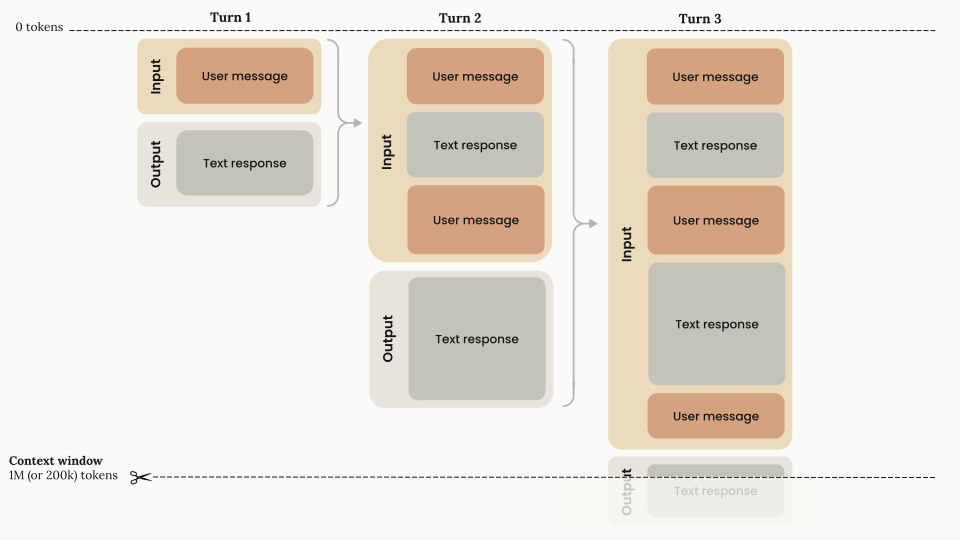

# Context windows and memory limitations

## Definition

The context window is the model's **working memory** meaning everything it can see in one request.

- The system prompt instructions
- The conversation history
- Your current prompt
- Files, tool outputs, and search results
- The model’s response

> A 1M-token window fits roughly 750,000 words, but size alone doesn't guarantee quality. Clean, relevant context matters more than just stuffing in more information.

## Context rot

This happens when too much irrelevant or repeated information in the context window degrades the model’s ability to focus and produce good answers. It doesn’t fail obviously but it just gives subtly worse answers over time.

| Fill level | Typical behaviour |
|------------|------------------|
| < 30% | High accuracy, fast recall |
| 30–70% | Slight degradation, still reliable |
| > 70% | Noticeable memory issues, possible contradictions |
| Near full | Automatic truncation, smart compression |

## Managing context health

**Start a new chat often to keep answers clear and accurate.**

It helps because:
- The model only sees what’s needed now
- Old irrelevant context doesn’t interfere
- Responses stay cleaner and more reliable
- You reduce the risk of confusion or missing details

## References

- [Context windows — Anthropic Claude Docs](https://platform.claude.com/docs/en/build-with-claude/context-windows)
- [Context-File Basics: Tokens and Memory Management — Juniper Community](https://community.juniper.net/blogs/christian-graf/2026/03/18/context-file-basics-tokens-and-memory-management)
